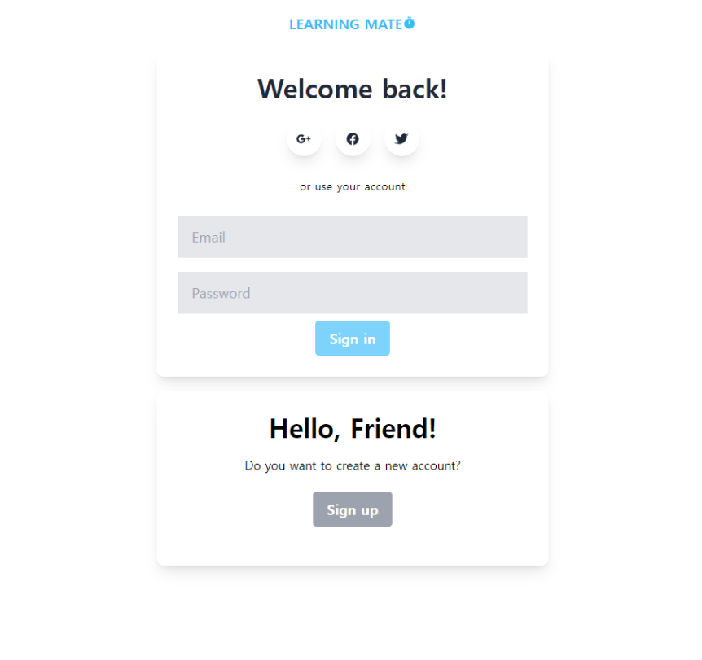
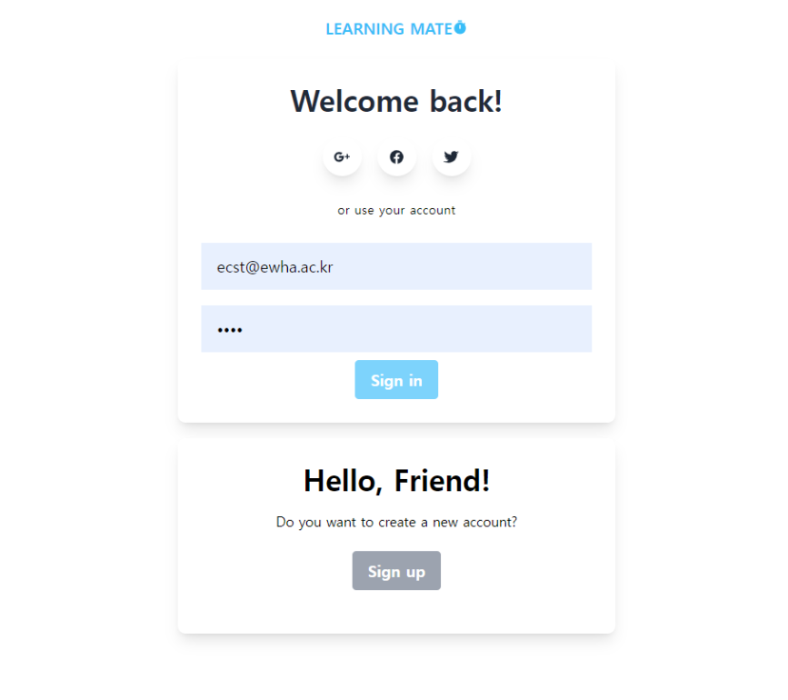
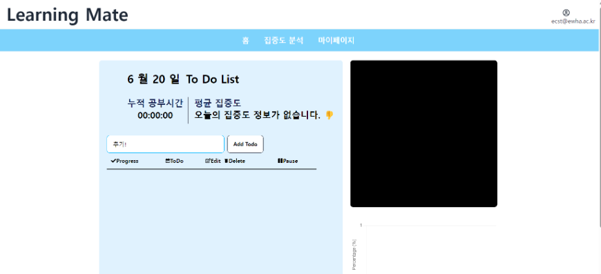
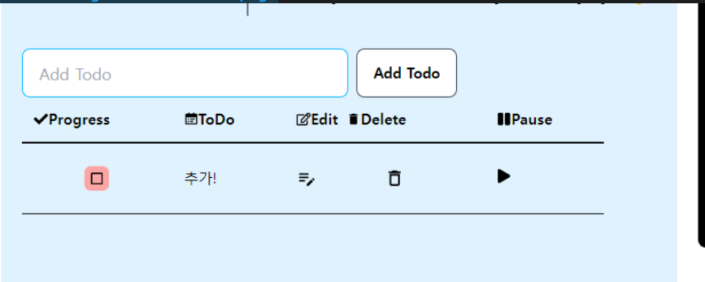
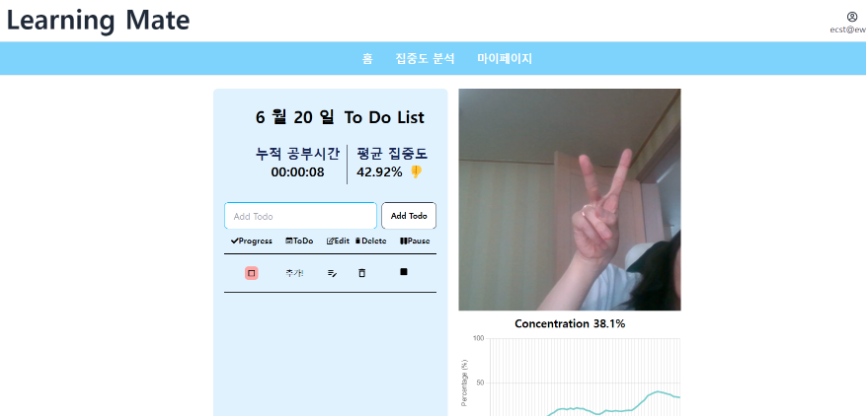
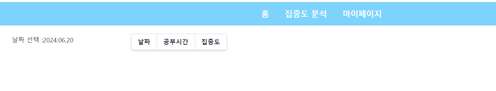

우리 프로젝트의 주요 폴더 구조는 아래와 같다.
```bash
ECST/
├── frontend/
│   ├── node_modules/
│   ├── public/
│   │   ├── index.html
│   │   └── ...
│   ├── src/
│   │   ├── components/
│   │   ├── App.js
│   │   ├── index.js
│   │   └── ...
│   ├── .gitignore
│   ├── package.json
│   ├── package-lock.json
│   └── README.md
│
├── backend/
│   ├── myproject/
│   │   ├── __init__.py
│   │   ├── settings.py
│   │   ├── urls.py
│   │   ├── wsgi.py
│   │   └── ...
│   ├── myapp/
│   │   ├── migrations/
│   │   ├── __init__.py
│   │   ├── admin.py
│   │   ├── apps.py
│   │   ├── models.py
│   │   ├── tests.py
│   │   ├── views.py
│   │   └── ...
│   ├── db.sqlite3
│   ├── manage.py
│   ├── requirements.txt
│   └── README.md
│
└── README.md

```

앞으로 실행을 위한 명령어를 소개할 것인데, 폴더 구조를 잘 파악해서 적절한 위치에서 해당 명령어를 수행해야 한다. (잘못된 위치에 실행하면 절대 안된다.)
## 1. env setting
먼저 가상환경 폴더를 세팅한다.
해당 명령어는 ECST폴더 바로 안에서 진행한다.

```bash
## terminal command : 가상환경 만들기
python -m venv env

.\env\bin\activate

```

## 2. FE 설정 및 모듈 설치

```bash
# FE 폴더로 이동 후, 설치 
## ECST/frontend로 이동해야 한다.
cd frontend  
  
npm install vite  
  
npm install react-redux @reduxjs/toolkit react-chartjs-2 chart.js


```

## 3. BE server + DB setting

```bash
# backend 폴더로 이동
## ECST\backend
cd backend

python manage.py makemigrations user study concentrate 
python manage.py migrate 
python manage.py runserver

## rest
pip install djangorestframework

## cors
pip install django-cors-headers

```


## 4. DEMO 실행

```bash
# 아래의 로컬주소로 들어간다.
http://localhost:5173/

```


이런 화면이 보이면, `Sign up` 버튼을 누른다.

#### 가상 계정 회원가입

```bash
ID : ecst@ewha.ac.kr
password : 1234
password confirm : 1234
name : ecst
tel : 010-8888-8888
email : ecst@ewha.ac.kr
```

회원가입이 완료되면 로그인 화면으로 돌아와 로그인 한다.


메인화면에 접속되면, `Todo`를 생성한다.


이렇게 투두 항목이 생기면 마지막 열에 있는 재생 버튼을 클릭한다.



캠이 켜지고, 집중도 분석이 되는 것을 확인할 수 있다.


과거의 집중도 분석은 `집중도 분석`메뉴로 들어가면 확인할 수 있다.
(참고로, 방금 생성한 계정의 경우 과거의 기록이 없어서 아무런 기록이 없다)

